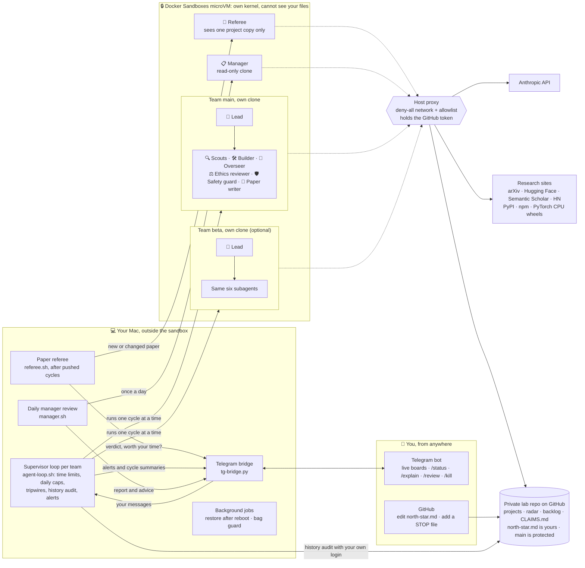

# Autonomous Research Lab

**by Pranav Nandyalam ([@pranavnandyalam](https://github.com/pranavnandyalam))**

An AI research lab that runs on your Mac while you do other things. A team of Claude Code agents scouts what is
happening in AI right now, picks small questions worth testing, plans and runs CPU-sized experiments, reviews its own
work, and pushes everything to a private GitHub repo. It runs inside an isolated Docker Sandboxes microVM, and you
watch and steer it from your phone over Telegram.

> **Experimental.** Built and tested on one Apple Silicon MacBook (October 2026: Docker Sandboxes `sbx` v0.46,
> Claude Code 2.1.280 in the sandbox). Expect rough edges, read [DESIGN.md](DESIGN.md) before running it, and
> start with the supervised single cycle.

## How it fits together



Everything the agents do happens inside the sandbox. They reach the internet only through the host proxy's allowlist,
and GitHub only through a token that never enters the sandbox. The supervisor loop on your Mac is plain shell (not an
AI): it starts each cycle, enforces the limits, and alerts you. You steer the lab with `north-star.md` and Telegram.

## The team

| Agent | Default model | Job |
|---|---|---|
| 🧠 Lead | Sonnet | Runs each cycle: reads your goals, decides what to do, coordinates, commits and pushes |
| 🔍 Scouts (up to 3) | Sonnet | Search arXiv, Hugging Face, Hacker News, Semantic Scholar for trends and open problems |
| 🛠 Builder (up to 2) | Opus | Writes and runs the experiment code in one project folder each |
| 🧐 Overseer | Opus | Skeptical reviewer of every plan, diff and result; can reject |
| ⚖️ Ethics reviewer | Sonnet | Harm, privacy, licensing, honesty checks |
| 🛡 Safety guard | Sonnet | Gate before every commit: secrets, forbidden files, repo and remote checks |
| 📝 Paper writer | Opus | Turns a finished project into an IEEE conference paper (LaTeX, compiled PDF) |

You steer it with one file you own, `north-star.md` in the lab repo (the agent may never edit it). The default
goal is **novelty**: keep a live "radar" of the top things happening in AI and turn the best into small,
reproducible projects that contribute something nobody has done. Checking someone else's claim is only a
baseline step, and every research plan must open with "What's new here" backed by a literature check that the
overseer verifies. You can change all of this (see [Changing the lab's goals](#changing-the-labs-goals)). Each project ends with a write-up (takeaway, method, results over several seeds, limitations, an AI-authorship
note) and an IEEE-format paper that an independent referee tries to tear apart (see [Papers and the referee](#papers-and-the-referee)).

## How it stays safe

The reviewer agents catch sloppy or harmful work, but they are AIs too, so the hard limits do not depend on them:

- **Sandbox:** a Docker Sandboxes microVM with its own kernel and no access to your files (no shared folders).
- **Network allowlist:** deny-all, plus arXiv, GitHub, Hugging Face, Semantic Scholar, HN, PyPI, npm, and
  `download.pytorch.org` / `download-r2.pytorch.org` (CPU-only torch wheels). The claude.ai connector proxy is
  explicitly denied, so your Gmail/Drive/other connectors can never reach the agent.
- **CPU only, small disk footprint:** every cycle runs with `UV_TORCH_BACKEND=cpu`, `HF_HOME` pointing at one shared
  model cache (`/home/agent/models/hf_cache`) and `PIP_NO_CACHE_DIR=1`. The manual (§7) says to install packages
  with `uv` only and never CUDA, `nvidia-*` or `triton` wheels: the default torch wheel drags ~4 GB of unusable CUDA
  libraries into every venv on a VM with no GPU. There is no GPU because the sandbox is a Linux microVM, and Apple's
  GPU (MPS/MLX) needs Metal, which a Linux guest cannot reach.
- **GitHub token outside the VM:** a fine-grained token that can only touch the one lab repo is held by the host
  proxy; the VM only ever sees a placeholder.
- **Protected history:** a branch ruleset blocks force pushes and deletion on `main`; the host also audits that `main`
  only ever moves forward.
- **Permissions:** Claude runs in `dontAsk` mode with an allow list and enforced deny rules (no sudo, no force push,
  no editing its own config or hooks, no reading credentials).
- **A supervisor that is not an AI:** `agent-loop.sh` on your Mac enforces a 50-minute cycle limit, a daily cycle
  cap per team, cleanup of any process a cycle leaves running in its clone, tripwires for the agent changing its
  own configuration, a halt after repeated failures, and alerts.
- **You:** a pinned Telegram live board, a message after every cycle, and `/kill` to stop it instantly.

`preflight.sh` tests all of this automatically (network, isolation, secrets, token scope, connector leak); fix
every FAIL before turning it on.

## What you need

- An **Apple Silicon Mac** with macOS 14 or later, [Homebrew](https://brew.sh), and room for a 60 GB sandbox disk.
- A **Docker account** for [Docker Sandboxes](https://docs.docker.com/ai/sandboxes/) (no Docker Desktop needed).
- A **Claude subscription** (signed in inside the sandbox with `/login`) or an Anthropic API key.
- A **GitHub account** for the private lab repo, and the `gh` CLI (recommended).
- Optional: **Telegram** for the phone view; **Amphetamine** if you want it to run with the lid closed on the charger.

## Usage and cost

Every cycle is a long Claude Code session with several agents. On the author's Mac one planning cycle used about
**$3.40 of API-equivalent usage** (mostly Sonnet), and cycles that write and run code can use more. The default cap is
**6 cycles per day**. On a subscription this comes out of your plan's usage limits, so watch your usage page for a few
days before raising `MAX_CYCLES_PER_DAY`. Long unattended runs on a personal plan may not be what the plan is meant for:
check your provider's terms, and use an API key and a spending limit if you want to run it hard.

## Quick start

```bash
brew install tmux gh
brew trust docker/tap && brew install docker/tap/sbx    # Docker Sandboxes CLI
sbx login                                                # Docker account, opens a browser

git clone https://github.com/pranavnandyalam/autonomous-research-lab && cd autonomous-research-lab
cp config.local.sh.example config.local.sh               # set OWNER_NAME and GITHUB_USER (and Telegram id, optional)
```

On GitHub:
1. Create a **private** repo named `agent-lab` with "Add a README" ticked.
2. Settings → Rules → Rulesets → new branch ruleset on the default branch: tick **Restrict deletions** and
   **Block force pushes** (nothing else).
3. Create a **fine-grained token** with access to only `agent-lab`: Contents, Issues, Pull requests read/write;
   Metadata read. 90-day expiry.

Then:
```bash
bash setup.sh --dry-run          # preview
bash setup.sh                    # sandbox, network policy, settings, repo clone, seed files; it asks for the token
sbx exec -it agent-lab claude    # type /login once, finish in the browser, then /exit
bash preflight.sh && bash preflight.sh --live    # safety tests (the --live part makes 4 tiny Claude calls)
```
Edit `north-star.md` in your lab repo on GitHub, then run one supervised cycle and watch it:
```bash
./agent-loop.sh main --once      # in another terminal: ./watch-cycle.sh
```
When you are happy:
```bash
bash deploy.sh                   # copies the kit to ~/agent-lab-kit (macOS blocks background jobs in ~/Documents)
~/agent-lab-kit/agent-ctl.sh on  # runs until you stop it
```
Optional Telegram: create a bot with @BotFather, put your numeric id (from @userinfobot) in `config.local.sh`, press
Start in the bot chat, then `bash setup.sh telegram`. Turn on Telegram two-step verification.

## Changing the lab's goals

The goals live in `north-star.md` in your lab repo. They are yours: aim the lab at a topic, switch it to pure
replications, ask it to build a tool, or tighten the limits. Three ways to change them:

- **On GitHub** (works from your phone): open `north-star.md` in your lab repo and edit it.
- **On your Mac:** `./goals.sh edit` opens the goals in your editor, shows exactly what changed, asks before
  pushing, and leaves the agent a note to re-read them. `./goals.sh show` prints them; `./goals.sh set FILE`
  swaps in a whole file.
- **Read them on Telegram:** `/goals`.

The agent reads the file at the start of every cycle, so changes apply from the next cycle. It can never edit
the file itself (deny rules, the pre-commit hook and the safety guard all block it). Keep the "Hard limits"
section unless you know why you are removing it.

## Daily use

| Want | Mac | Phone (Telegram) |
|---|---|---|
| Status | `~/agent-lab-kit/agent-ctl.sh status` | `/status` |
| Watch everything live | `./view.sh` (tmux: every step, the board, the log; reopen with `tmux attach -t agent-view`) | pinned live board, `/live` |
| Plain-English summary | | `/explain` (also added to the board when each cycle ends) |
| Last cycle's report, trend radar | `python3 activity.py` | `/last [team]`, `/radar` |
| Pause / stop after this cycle / resume | `agent-ctl.sh pause 2h` / `stop` / `go` | `/pause 2h` / `/stop` / `/go` |
| Stop right now | `agent-ctl.sh kill` | `/kill` |
| Everything off | `agent-ctl.sh off` | add a `STOP` file to the repo |
| See / change the lab's goals | `./goals.sh show` / `./goals.sh edit` | `/goals` |
| Tell the agent something | | any text message (read at the start of the next cycle) |
| Make your edits to the kit live | `bash deploy.sh` | |

The agent asks you things in `questions.md` in the lab repo; answer there (on GitHub). Each team watches that file,
and when it changes you get one Telegram alert listing the open questions; the same set of open questions alerts at
most once a day, however many teams see the change.

Nothing here deletes work: a stopped sandbox keeps its files, and everything pushed stays on GitHub.
`bash uninstall.sh` removes everything the kit set up (it asks before each part and never deletes your repo).

## Multiple teams

Run several agent teams in parallel on different projects. Each team has its own Lead and subagents, its own clone
of the lab repo inside the sandbox (so two Leads never share a working tree), its own daily cycle cap, and its own
live board on Telegram. Teams pick their projects freely, claim them in `CLAIMS.md` so they never duplicate each
other, never edit another team's projects, and share the radar and backlog (rules in `prompt.md` §5b).

```bash
TEAM=beta bash setup.sh team          # clone + safety hook for team "beta"
# config.local.sh:  export TEAMS="main beta"
bash deploy.sh && ~/agent-lab-kit/agent-ctl.sh on     # starts every team in TEAMS
./view.sh beta                        # live terminal view of team beta
```
Telegram: free text goes to every team, `@beta ...` to one team, and `@beta /last` (or any `@team /command`) runs
that command for one team. `/explain beta` summarizes one team; `/last beta` shows that team's latest finished cycle
report, while plain `/last` shows the newest finished report of any team (and says so if a cycle is still running).
Each team's cycles
cost the same as one team's, so usage scales with the number of teams; `MAX_CYCLES_PER_DAY` is per team. Two teams
fit an 18-core Mac comfortably; more teams compete for the sandbox's CPU.

## Manager review (optional, recommended with several teams)

Once a day a **manager** agent reviews every team against your goals: is each project worth doing, is it making
real progress, is the work rigorous, are teams overlapping, is the cost justified? It sends you a plain-English
report on Telegram with any decisions only you can make, and gives each team concrete advice for its next cycle.

```bash
bash ~/agent-lab-kit/setup.sh manager     # its own read-only clone + a daily run at MANAGER_HOUR:MINUTE (19:30)
```
Telegram `/review` runs one now. It is deliberately powerless: it can only read files (no shell, web or writes), its
advice reaches the teams as a labelled colleague's opinion (never as your instructions), and stopping or switching a
project stays your call. A review costs roughly $0.25-2 with Opus.

## Papers and the referee

When a project is finished, its team's **paper writer** produces `projects/<slug>/paper/`: an IEEE conference
paper (`main.tex` in IEEEtran, `refs.bib` with fetched and verified references, figures made by a committed script,
and the compiled `main.pdf`). The team's overseer checks it in PAPER mode before it is committed. The rules are in
the manual, `prompt.md` §8b.

After every pushed cycle the host looks for new or changed papers and sends each one to an **external referee**
(`referee.sh` + `referee.md`, Opus by default). It is built to have no stake in the work:

- it runs from its own clone, with a fresh copy of **only that project** as its working directory; reads of every
  lab clone are denied, so the team's notes, logs and reviewer verdicts cannot bias it;
- it is told to find holes: trace every headline number to the raw data, look for leakage, cherry-picking and
  missing baselines, compare the paper with its pre-registered PLAN.md, search arXiv and Semantic Scholar for prior
  work the paper missed, and fetch every reference (a fabricated one is fatal);
- it can only read and search the web (no shell, no writes).

You get a prominent Telegram message only when it judges the paper **worth your time** (publishable as is or with
fixes, no fatal hole, real novelty), with a link to the PDF; otherwise one line. Its required fixes go back to the
team as `REFEREE_REPORT`, the team revises, and a changed paper is re-refereed (at most `REFEREE_MAX_ROUNDS`, 3).

```bash
bash ~/agent-lab-kit/setup.sh referee            # its own read-only clone (once)
bash ~/agent-lab-kit/referee.sh --force <slug>   # review one paper now
```
The sandbox needs LaTeX for papers to compile: allow `ports.ubuntu.com` briefly, install `latexmk
texlive-latex-recommended texlive-latex-extra texlive-fonts-recommended texlive-publishers texlive-science lmodern`
with apt inside the sandbox, then remove the allow rule (`setup.sh referee` checks for it). A review costs roughly $1-3.

## Laptop or desk (`POWER_MODE`)

- **portable** (default): closing the lid sleeps the Mac; the sandbox freezes and resumes when you open it (time
  asleep does not count toward the cycle limit). On battery no new cycle starts; it resumes by itself on the charger.
  No sudo. Safe in a bag.
- **Lid closed on the charger:** use an Amphetamine trigger on "power adapter connected" with closed-display mode and
  its Power Protect add-on, then `bash ~/agent-lab-kit/setup.sh bagguard`. The bag guard checks every 30 s and, on
  battery, turns lid-closed mode off and sleeps the Mac if the lid is closed (Amphetamine alone left it awake in
  testing, and so did any running `caffeinate`).
- **always-on:** `agent-ctl.sh on` runs `sudo pmset -a disablesleep 1`. Plugged in, hard surface, never in a bag.

## Files

`prompt.md` the Lead's manual · `agents.json` the subagents · `settings.json` permissions · `config.sh` settings ·
`config.local.sh.example` your values · `render.py` fills your values into the templates · `setup.sh` setup ·
`preflight.sh` safety tests · `goals.sh` read or change the goals · `agent-loop.sh` supervisor · `agent-ctl.sh` controls · `deploy.sh` make edits live ·
`tg-bridge.py` Telegram · `activity.py` live board · `narrate.py` plain-English summary · `watch-cycle.sh` terminal
viewer · `view.sh` all-in-one live view · `bag-guard.sh` battery safety · `manager.sh`/`manager.md` daily manager
review · `referee.sh`/`referee.md` paper referee · `uninstall.sh` remove everything · `pre-commit-hook.sh` installed in the lab
repo · `repo-seed/` the lab repo's starting files · [DESIGN.md](DESIGN.md) why it works this way

## License and disclaimer

[MIT](LICENSE). Everything the lab produces is generated by an autonomous AI agent and is not peer reviewed; you are
responsible for what it does with your accounts and what you publish from it.
